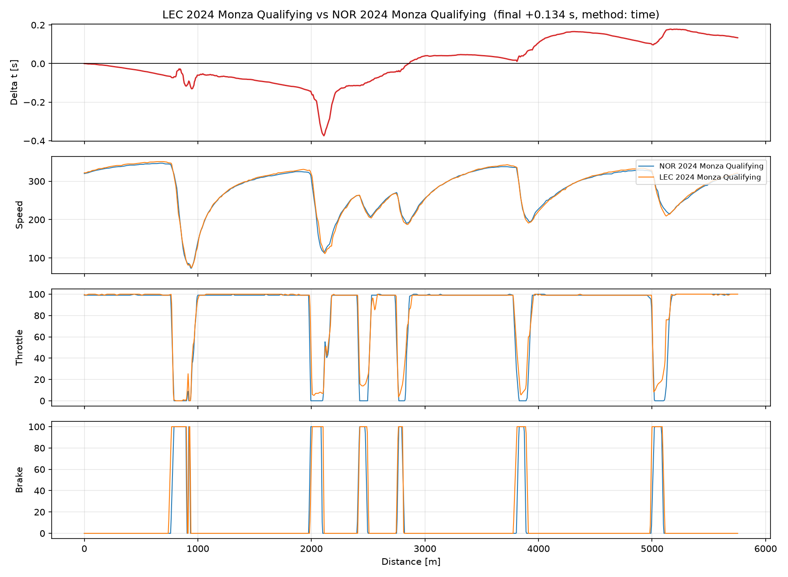
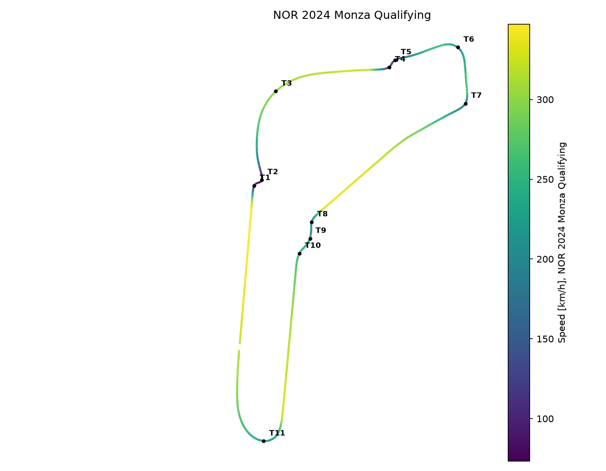

# apex-trace

Source-agnostic race telemetry analysis.

The goal: ingest lap telemetry from any source (real F1 timing data via
[FastF1](https://github.com/theOehrly/Fast-F1), or racing sims like Assetto
Corsa and F1 25), normalise it onto a canonical distance-based representation,
and run the same comparison engine on top: cumulative time delta, channel
overlays, corner-by-corner segmentation and driving metrics.

**Status: M3 (corner segmentation, per-corner report, landmark alignment).**

## Headline result



Leclerc vs Norris, Monza 2024 qualifying. The top panel is the cumulative
time delta (positive means Leclerc behind); the channels below explain it.
Leclerc gains steadily on the straights with a lower-drag Ferrari and brakes
visibly later into the Roggia chicane (the sharp spike at 2100 m), but pays
on every corner exit; the Lesmos and Ascari account for the 0.134 s he
concedes over the lap.

The engine is validated against official timing gaps in five scenarios
(fast, slow and street tracks; qualifying and race laps): zero measured
error for the default method. Reproduce with `examples/validate_delta.py`.

## Corner by corner

The same lap pair, segmented and read the way a race engineer would say it:

```
corner apex_a_kmh apex_b_kmh brake_m  apex_m power_m coast_a_m coast_b_m entry_s  exit_s total_s
 T1-T2       73.1       75.0   -24.2     0.1     6.3      10.0       5.0  +0.062  -0.215  -0.154
 T4-T5      113.7      111.4     6.7     5.0    -0.3       5.0       0.0  -0.134  +0.243  +0.110
    T6      207.2      204.1     1.4     0.0     0.0       5.0       0.0  +0.082  +0.015  +0.097
    T7      190.4      187.3   -10.0    -4.9    15.5      10.0       0.0  +0.072  -0.065  +0.007
 T8-T9      194.1      191.0   -26.1    -5.8    11.8      15.0       0.0  -0.047  +0.123  +0.076
   T11      215.1      209.3    -5.9   -20.2    -0.0      20.0       0.0  -0.048  +0.047  -0.001
```

Corners are speed minima found by peak detection with thresholds in
physical units; segments tile the lap at the midpoints between apexes, so
the per-corner deltas sum to the full-lap delta exactly (here +0.134 s,
matching official timing). Positive position deltas mean lap B does it
later along the track: Leclerc brakes 6.7 m deeper into Roggia but gets
back to full throttle 15.5 m later out of Lesmo 2 and 11.8 m later out of
Ascari, which is where the lap is lost. Labels come from the official
corner marks, projected onto the driven line via the position channels.



The same marks anchor the distance-axis alignment between the two laps
(each lap measures the track with its own integrated odometer, so the axes
disagree by metres). Validated against official sector times: interior
delta error drops from 0.069 s to 0.043 s RMS across the five scenarios.
Reproduce with `examples/validate_alignment.py`.

## Why source-agnostic

Comparing two laps rigorously means resampling every channel onto a common
distance axis. Once that normalisation exists, the analysis engine stops
caring where the data came from: adding a new telemetry source is just
writing one more loader that produces the same canonical `Lap`. That
source-independence is the point of the project.

## Stack

Python 3.12 · pandas · NumPy · SciPy · matplotlib · FastF1 · managed with
[uv](https://github.com/astral-sh/uv)

## Quick start

```bash
uv sync
uv run python examples/hello_fastf1.py       # smoke test: lap times
uv run python examples/plot_speed_trace.py   # one lap through the pipeline
uv run python examples/compare_laps.py       # delta + overlays, two laps
uv run python examples/validate_delta.py     # engine vs official timing
uv run python examples/check_corners.py      # corner detection + events
uv run python examples/corner_report.py      # per-corner comparison table
uv run python examples/track_map.py          # map coloured by speed
uv run python examples/validate_alignment.py # alignment vs sector times
```

The first run downloads one F1 session into a local cache (`.fastf1_cache/`,
takes a minute or two); subsequent runs are near-instant.

Loading a lap in your own code:

```python
from apextrace.loaders.fastf1_loader import load_fastf1_lap

lap = load_fastf1_lap(2024, "Italian Grand Prix", "Q", "NOR")
lap.data.head()   # canonical channels on a uniform 5 m distance grid
lap.lap_time      # seconds
```

## Roadmap

- [x] **M0**: skeleton, environment, FastF1 data chain
- [x] **M1**: canonical `Lap` (uniform distance grid) + FastF1 loader
- [x] **M2**: cumulative time-delta engine + channel overlays
- [x] **M3**: corner segmentation, per-corner report, landmark alignment
- [ ] **M4**: second loader (sim telemetry) through the same, untouched engine
- [ ] **M5**: setup-symptom heuristics (exploratory)

## Honest limits

Cross-source comparisons (real F1 vs sim) are qualitative: car, tyres,
downforce and track geometry all differ, so a numeric delta between sources
does not mean "you are X seconds slower". Within one source the comparison
is quantitative. FastF1 telemetry has no steering channel and a near on/off
brake signal; the richer channels live in sim data.
